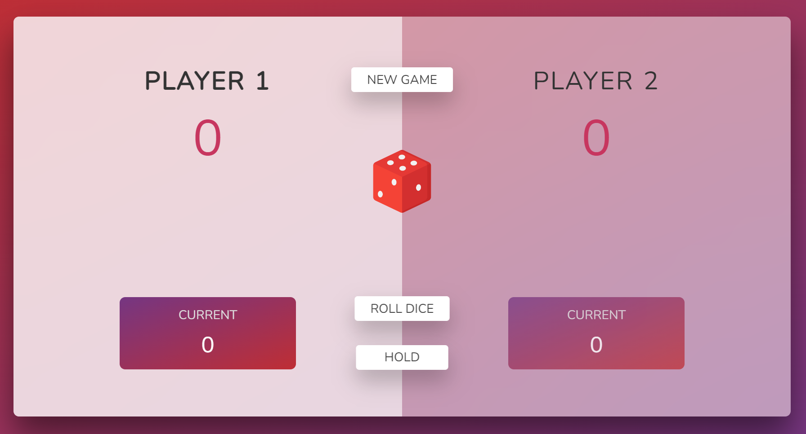
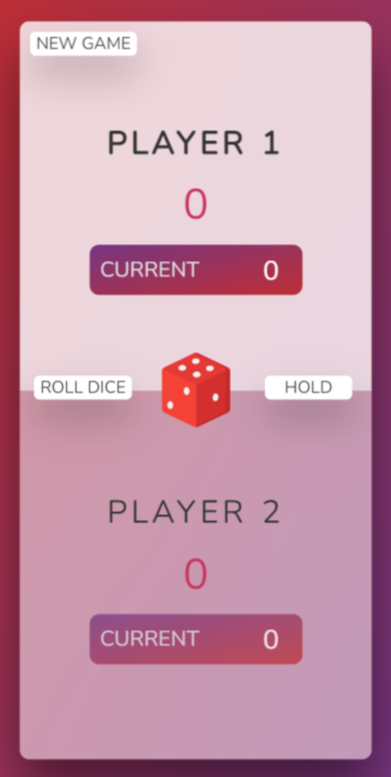

<html>
  

  <h1> THE PIG GAME </h1>
  <h3> The Pig Game is a basic Multiplayer Game where 2 Players Race against each other to reach 100 Points. Players take turns with a die . The Game start with Players 1's turn. On a Player's turn, they can roll the dice as often as they like. If the roll is a 2, 3, 4, 5, or 6, the Player adds that many points to their Current Score for the turn. The Player may also choose to end their Turn and Bank their Current Score to the Total Score. But the Player is risking every time they roll because if the result is a 1, they lose the Current Score, and the turn changes. The other Player repeats the same process of risking to roll or holding to bank the score. So the Pig Game is a Risk Game. The Player who Hurdles and Reaches the Target Score (100) first Wins. I hope you Enjoy this Game! </h3>
  

  

       
       
  

  

  <h3> Enjoy this Game with your Friends and Family! Thank You.</h3>
  <h3>Tap on this Link to Play the Game: https://eshantrivedi21.github.io/Pig-Game/</h3>
  

 </html>
